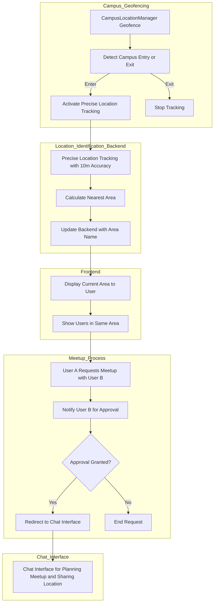

# **Contributing**

## **Background Information**

### User journey flow

- this uses mermaid syntax. You can use the [mermaid live editor](https://mermaid.live/) to visualize the diagram



### **How To Set Custom Location in Xcode Simulator**

1. In the simulator, go to `Features > Location > Custom Location`
2. Enter the desired location in latitude and longitude:
   - Examples:
     - University of Calgary
        - **latitude**: 51.078621
        - **longitude**: -114.136719
     - Science A:
        - **latitude**: 51.079549
        - **longitude**: 114.127
     - Apple Park (already in the simulator):
        - **latitude**: 37.3349
        - **longitude**: -122.00902
3. Click `OK` to set the custom location.

## **Prerequisites**

1. **Download Orbit** by [installing the zip file of this repository](https://github.com/psycho-baller/Orbit/archive/refs/heads/main.zip)
2. Build the app and open it to get started.

### **API Key Handling Guidelines**

#### **Overview**

To ensure the security of sensitive information, API keys must not be committed to the repository. This guide outlines the steps you should follow to manage API keys locally in your development environment.

#### 1. Creating Your Local APIKeys.plist

1. **Copy the Template:**
   - Create a new file in your project’s Resources folder named `APIKeys.plist`.

2. **Insert the Following Template:**

   ```xml
   <?xml version="1.0" encoding="UTF-8"?>
   <!DOCTYPE plist PUBLIC "-//Apple//DTD PLIST 1.0//EN" "http://www.apple.com/DTDs/PropertyList-1.0.dtd">
   <plist version="1.0">
   <dict>
       <key>APPWRITE_PROJECT_ID</key>
       <string></string>
   </dict>
   </plist>
   ```

3. **Location:**
   - Place the `APIKeys.plist` file in the **Resources** folder of your project (e.g., `Orbit/Resources/APIKeys.plist`). This ensures it will be bundled with the app while remaining separate from the source code.

#### **2. Excluding APIKeys.plist from Version Control**

- The `APIKeys.plist` file is already listed in the `.gitignore` file to prevent it from being committed to the repository.
- **Important:** Do not remove or modify the `.gitignore` entry related to API key files.

#### **3. Accessing the API Keys in Code**

- The application is configured to load API keys from the `APIKeys.plist` file in the Resources folder. For example, you can load the API key in Swift as follows:

  ```swift
  import Foundation

  class APIManager {
      static let shared = APIManager()
      var apiKey: String?

      private init() {
          if let url = Bundle.main.url(forResource: "APIKeys", withExtension: "plist"),
             let data = try? Data(contentsOf: url),
             let plist = try? PropertyListSerialization.propertyList(from: data, options: [], format: nil) as? [String: Any] {
              apiKey = plist["APPWRITE_PROJECT_ID"] as? String
          }
      }
  }

## **Development**

### **Architecture: MVVM + Services**

The project uses the **MVVM** architecture with Services for backend calls where:

1. **Model** (M): Enforces data types for data coming in and going to the database.
2. **View** (V): Is the frontend graphic user interface (GUI/screen) the user interacts with.
3. **ViewModel** (VM): Connects the Model to View ensuring the screens are redrawn with the data loaded in the ViewModel changes.
4. **Service**: Are backend calls to the Appwrite database.
   - <https://appwrite.io/>

#### **Example**

##### **Model**

```swift
struct UserModel {
    let accountId: String
    let name: String

    init(accountId: String, name: String){
        self.accountId = accountId
        self.name = name
    }
}

typealias UserDocument = AppwriteModels.Document<UserModel>
```

##### **View**

```swift
struct UserView: View {
    // The ViewModels are declared at the App.swift level as follows:
    // @StateObject var userVM = UserViewModel()

    // To use a ViewModel in a screen add the following line
    @EnvironmentObject private var userVM: UserViewModel

    var body: some View {
        VStack {
            Text(userVM.currentUser.name)
            Button("Update Name") {
                userVM.updateUser("New Name")
            }
        }
    }
}
```

##### **ViewModel**

```swift
class UserViewModel {
   @Published var currentUser: UserModel?

   private var userService = UserService()
   @MainActor
   func updateUser(accountId: String, updatedUser: UserModel) async {

     guard let updatedUserDocument = try await userService.updateUser(
                 accountId: accountId, updatedUser: updatedUser)
     else {
         throw NSError(domain: "User not found", code: 404, userInfo: nil)
     }

     if id == currentUser?.accountId {
           // Update the currentUser
           self.currentUser = updatedUser
     }
   }
}
```

##### **Service**

```swift
import Appwrite

class UserService {

    func getUser(_ accountId: String) async throws -> UserDocument? {
        let query = Query.equal(
            "accountId",
            value: accountId
        )  // Query by accountId
        let response = try await appwriteService.databases.listDocuments<
            UserModel
        >(
            databaseId: appwriteService.databaseId,
            collectionId: collectionId,
            queries: [query],
            nestedType: UserModel.self

        )
        // Check if any document was found
        if let document = response.documents.first {
            return document
        } else {
            throw NSError(domain: "User not found", code: 404, userInfo: nil)
        }
    }

    func updateUser(accountId: String, updatedUser: UserModel) async throws -> UserDocument?
        {
        // Step (1): Find the documentId based on accountId
        guard let userDocument = try await getUser(accountId) else {
            print("Cannot update user")
            return nil
        }

        let documentId = userDocument.id

        // Step (2): Perform update using the documentId
        let updatedDocument = try await appwriteService.databases
            .updateDocument<UserModel>(
                databaseId: appwriteService.databaseId,
                collectionId: collectionId,
                documentId: documentId,
                data: updatedUser.toJson(),
                permissions: nil,
                nestedType: UserModel.self
            )
        return updatedDocument
    }
}
```
