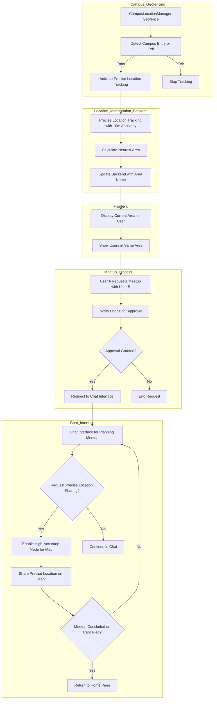

# Contributing

## Background Information

### User journey flow

- this uses mermaid syntax. You can use the [mermaid live editor](https://mermaid.live/) to visualize the diagram

## Prerequisites

## Development

## Production

## Testing