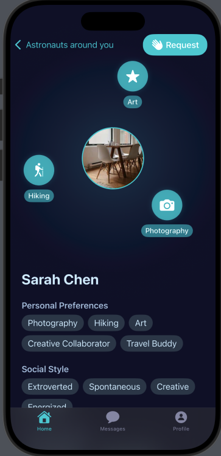

# Profile Views Documentation

## Overview
The Orbit app features several profile-related views that allow users to view their own profile and other users' profiles. This document outlines the key components and their functionality.

## User Profile View
The main profile view that users see when viewing their own profile.

### Key Features
- Displays user's profile information
- Shows orbiting interests animation
- Integrates with the ProfilePageView component

*User's own profile showing orbiting interests and personal information*

## Profile Page View
A reusable component used for displaying both the user's own profile and other users' profiles.

## User Profile View (Other Users)
The view shown when viewing another user's profile, including additional interaction options.

### Features
- View user's complete profile
- Send meetup request
- Custom message composition

*View when looking at another user's profile with meetup request button*

## Implementation Notes

1. **Profile Picture Handling**
   - Async loading of profile images
   - Fallback to system SF Symbol "person.circle.fill"
   - Circular cropping with overlay

2. **Interest Orbiting Animation**
   - Continuous rotation animation
   - Dynamic positioning based on number of interests
   - Custom icons for different activities

3. **Responsive Layout**
   - Scrollable content
   - Adaptive to different screen sizes
   - Proper spacing and padding

